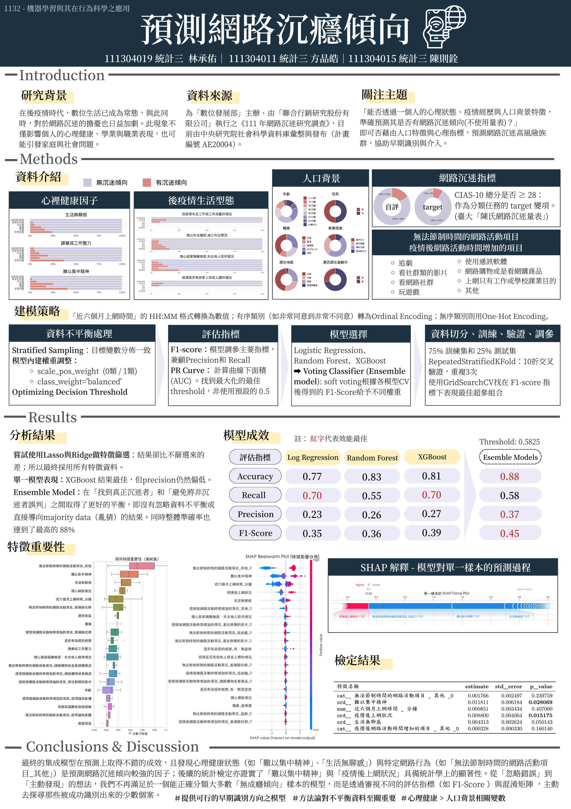

# 1132 機器學習與其在行為科學之應用－學碩合開
網路沉癮風險預測－不平衡資料下的機器學習實作

這份專案中，我使用到以下的工具（主要於本機端使用jupyter環境實作）：

在本專案中，我負責：
- 收集資料（來自SRDA)與資料前處理。
- 訂定研究背景與目標
- 建立模型（全部，包含集成模型），與處理不平資料（對各項模型以及資料使用的策略），嘗試使用lasso做特徵篩選
- 分析結果，做統計檢定與模型解釋
- 海報呈現與文字檔整理

***

## 關注主題

「能否透過一個人的心理狀態、疫情經歷與人口背景特徵，準確預測其是否有網路
沉迷傾向（非量表）？」可否藉由人口特徵與心理指標，預測網路沉迷高風險族群，協
助早期識別與介入。
我們期待找出網路沉迷傾向的關鍵預測因子，可否藉由人口特徵與心理指標，預測
網路沉迷高風險族群，並提供適當的輔導與介入。

## 建模策略

1. 資料不平衡處理
  - 分層抽樣 (Stratified Sampling): 在將資料切分為訓練集與測試集時，使用
stratify=y 的參數，確保訓練集與測試集中的目標變數分佈與原始資料集一致 。
2. 模型內建權重調整
3. 關注不同指標
  - 專案選擇 F1-score 作為模型調參與評估的主要指標，因為它能同時兼顧精
確率 (Precision) 和召回率 (Recall)，比準確率 (Accuracy) 更能反映模型在不平
衡資料上的真實表現
    - Precision 關注於，在所有「預測」為沉迷者，真的為沉迷者的情況。
    - Recall 則關注於，在所有「真正」為沉迷者中，預測正確的情況。
  - 我們希望 Recall 越高越好，這樣就可以正確預測；但我們也同時希望
Precision 越高越好，才不會都一直判斷錯誤，把不是沉迷者的結果都判斷為沉迷
者，這樣就會太多人被誤判。
4. 優化決策閾值 (Optimizing Decision Threshold)

## 研究結果

使用集成模型，讓在單一模型中，與表現最好XGboost相比
顯著提升了模型在少數類別上的綜合表現（F1-
Score 從 0.39 提升至 0.45）

我們不再滿足於一個能正確分類大多數「無成癮傾向」樣本的模型，而是從「忽略
錯誤」到「主動發現」，透過審視不同的評估指標（如 F1-Score ）與混淆矩陣 ，主動去
探尋那些被成功識別出來的少數個案。這正是早期識別與介入策略的核心所在——其價
值不在於完美地將所有人分類，而在於精準地找到最需要幫助的那些人。
